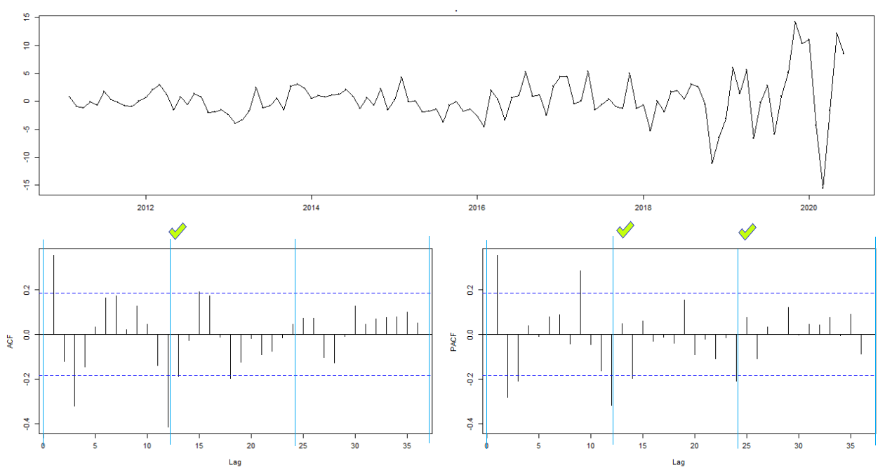

```{r setup, include=FALSE}
# chunk options
knitr::opts_chunk$set(
  message = FALSE,
  warning = FALSE,
  fig.align = "center",
  comment = "#>"
)
```

```{r, echo=FALSE, fig.align='center'}

```

# Objective
For a long time,I use product from Apple such as iPad. Overall, I like it. They look elegant and easy to use. Even the last few product kind of disappointment for me. One thing lead to another, this make me think how well Apple's stock in the market. With this article, I try to make a model to predict their stock value in the future. 

# Library 

The library that we use, you could see below.

```{r}
# load library

library(dplyr)     # data wrangling
library(lubridate) # date manipulation
library(forecast)  # time series library
library(MLmetrics) # calculate error
library(ggplot2)   # Beautify the graph
library(tidyr)     # Tidy the data
library(zoo)       # Order index observations
library(tseries)   # adf.test
```

# Read Data

Import data and read data from Apple Stock Dataset. I get the data from kaggle, you could see [here](https://www.kaggle.com/datasets/meetnagadia/apple-stock-price-from-19802021)
```{r}
# Read data
AAPL <- read.csv("AAPL.csv")

# Check the data
AAPL %>% head()
```
</br>

We change `Date` datatype. Select the column we need (Date, Close). Then complete the date, so it appears sequentially.

```{r}
AAPL <- AAPL %>% 
  mutate(Date = ymd(Date)) %>% 
  select(c(Date, Close)) %>% 
  complete(Date = seq.Date(min(Date), max(Date), by="day")) %>% 
  arrange()

AAPL %>% head()
```

```{r}
AAPL %>% tail()
```

This dataset has `Date` from **1980-12-12** to **2022-06-17**.
</br>
</br>
Before we do anything else, check if the data has missing value or not.

```{r}
# Check missing value
AAPL %>% is.na() %>% colSums()
```
The data has missing value </br>
</br>
Inspect the data with plot graph
```{r}
AAPL$Close %>% tail(200) %>% 
  plot(type="l",
       col = "blue",
       lwd = 2,
       xlab = "time (days)",
       ylab = 'Close',
       main = "Stock Market Close")
```
We can **not** use the data like that. Because time series data must appear sequentially. Let's recall from fundamental thing about time series data.
</br>

Main requirements for time series data:
(1) The data must be sorted according to the time period from the oldest data to the newest data
(2) The time interval must be the same
(3) No missing data for each interval
(4) Lastly, nothing can be missing on the dataset

So, we need to give some treatment to this dataset.
```{r}
library(zoo)
AAPL_new <- AAPL %>% 
  mutate(Close = na.fill(Close, "extend")) # Fill the missing value with "extend"

AAPL_new %>%   
  tail(200) %>% # get the last 200 data
  plot(type="l",
       col = "blue",
       lwd = 2,
       xlab = "time (days)",
       ylab = 'Close',
       main = "Stock Market Close") # Plot AAPL_new
```

Check the whole dataset with plot
```{r}
AAPL_new %>% 
    plot(type="l",
       col = "blue",
       lwd = 2,
       xlab = "time (years)",
       ylab = 'Close',
       main = "Stock Market Close")
```

Check the last 6 observations in dataset with plot
```{r}
AAPL_new %>% tail() %>% 
  plot(type="l",
       col = "blue",
       lwd = 2,
       xlab = "time (days)",
       ylab = 'Close',
       main = "Stock Market Close")
```

The graph already connected, we can continue the process. 
</br>

# Clean Data

Check data class `AAPL_new`
```{r}
class(AAPL_new)
```
The dataset has observation with day by day. We could make to month by month. So, the analysis more applicable to the problem.

```{r}
APPL_m <- AAPL_new %>% 
    group_by(month = lubridate::floor_date(Date, "month")) %>%
    summarize(Close = mean(Close))

APPL_m %>% head()
```
</br>

```{r, echo=FALSE, fig.align='center'}

```
<i> Products of Apple company <i>

# Time Series 

Make our data to Object TS / Time Series

```{r}
AAPL_ts <- ts(
  data = APPL_m$Close,
  start = c(1980,12,01),
  frequency = 12
)

class(AAPL_ts)
```
We successfuly make our data `APPL_m` to `ts` (time series). </br>

Plot `AAPL_ts`
```{r}
AAPL_ts %>% autoplot()
```

In my opinion, we should subset our time observation for analysis. If we use the year from 1980 to 2022, may many things is not relevant anymore. Based on graph above, let's only use the data from year 2010 to 2022. So, we have 12 years of observation.

```{r}
AAPL_w <- window(AAPL_ts, start = 2010) 

AAPL_w%>% autoplot()
```


# Cross Validation

Cross Validation by splitting Data Train and Data Test.

```{r}
# test
AAPL_test <- tail(AAPL_w, 24)


# train
AAPL_train <- head(AAPL_w, -length(AAPL_test))
```

Check `AAPL_train` with visualization

```{r}
AAPL_train %>% autoplot()
```
The graph above show `AAPL_train` already splitted. As we can see the time (x-axis) has less observation than before. </br>

Check `AAPL_train` trend and seasonal with `decompose`
```{r}
AAPL_dc <- decompose(AAPL_train, type = "multiplicative")
AAPL_dc %>% autoplot()
```
> `AAPL_train`, This data has an increasing trend from time to time. And also has seasonal. So, we use Hold Winters method.

```{r, echo=FALSE, fig.align='center'}

```
<i>One of the most famous Apple advertisement. This is for iPod<i>

# Holt Winters 

## Modeling

We are going model `AAPL_train` with Hold Winters method

```{r}
model <- HoltWinters(
  x = AAPL_train, 
  seasonal = "multiplicative"
)

model
```
## Forecasting

Forecast the model for 24 months (2 years)

```{r}
forecast_AAPL <- forecast(
  object = model,
  h = 24
) 

forecast_AAPL
```
## Visualising

Let us see how the model fit the unseen data (data test) with visualization.

```{r}
AAPL_train %>% 
  autoplot()+
  autolayer(AAPL_test, series = "test")+ # data test
  autolayer(model$fitted[,1], series = "fitted values")+ # fitted value data train
  autolayer(forecast_AAPL$mean, series = "forecast data test") + # forecast model 
  ggtitle("AAPL Stock") + # Give name to the graph
  scale_x_continuous(name = "Time (years)") + # Edit x-axis name
  scale_y_continuous(name = "Value (dollars)") # Edit y-axis name
```

## Conclusion 

> This Holt Winters model did well enough to capture the trend that happen in the last 24 months. As we can see from the graph above, the green line follow the trend that blue line. When the blue line go up, the green one do the same. 

> Unfotunately, this model not well enough to capture the actual value of Apple Stock

# Seasonal ARIMA

Seasonal Arima is an Arima method where the existing time series objects have a seasonal pattern. The process in make modeling using SARIMA are the same as when making ARIMA modeling.
</br>
ARIMA models are can be used in business problem where data has evidence of non-stationarity , where an initial differencing step can be applied one or more times to negate/abolish the non-stationarity of the mean function (for example like the trend).

## Stationary Test

We test the stationary of data with `adf.test()`. **Augmented Dickey Fuller test (ADF Test)** is a common statistical test used to test whether a given Time series is stationary or not. </br>
The hypothesis are : </br>
H0 : Data is not stationary </br>
H1 : Data is stationary </br>
</br>

```{r}
# ADF Test with `AAPL_w`
adf.test(AAPL_train)
```

We decide alpha = 5%. From Augmented Dickey-Fuller Test, we get p-value = 0.99. This means fail to reject HO, so the data is not stationary.

## Differencing
```{r}
diff(AAPL_train, lag = 12) %>% 
  diff() %>% 
  adf.test()
```

Now, the data is stasionary, with d = 1, D = 1 

## Model Fitting

Make SARIMA model with `auto.arima()` </br>
SARIMA(p,d,q)(P,D,Q)[freq]

```{r}
model_auto_sarima <- auto.arima(AAPL_train, seasonal = T)
model_auto_sarima
```

### Tuning the model manually

Framework to get the value of (p,d,q)(P,D,Q)seasonal

Step 1: Define the value of `D`.

Step 2: Define the value of `d`.

Step 3: Define the value of `P and Q`. For seasonal index, observe how much lag comes out in ACF/PACF when lag = freq/freq multiples.

```{r}
diff(AAPL_train, lag = 12) %>% 
  diff() %>% 
  tsdisplay(lag.max = 36)
```


For seasonal,  determining P and Q we look at the lag multiples based on the frequency of our data.

* P : 0, 1, 2
* D : 1
* Q : 0, 1

for the whole data determining p and q we see the first 5 lags that come out.

* p : 0, 1 ,2, 3
* d : 1
* q : 0, 1, 2

```{r echo=FALSE}

```
<i> The graph for seasonal <i>
</br>

The combination of model that might be formed : 
</br>
* SARIMA(0,1,0)(0,1,0)[12] </br>
* SARIMA(1,1,0)(0,1,0)[12] </br>
* SARIMA(2,1,0)(0,1,0)[12] </br>
* SARIMA(0,1,1)(0,1,0)[12] </br>
* SARIMA(1,1,1)(0,1,0)[12] </br>
* SARIMA(2,1,1)(0,1,0)[12] </br>

and still many more, we are only use these 6 combination because the scope would be to big if we test all of them.

```{r}
model_sarima_1 <- Arima(
  AAPL_train, order = c(0,1,0), seasonal = c(0,1,0))
model_sarima_2 <- Arima(
  AAPL_train, order = c(1,1,0), seasonal = c(0,1,0))
model_sarima_3 <- Arima(
  AAPL_train, order = c(2,1,0), seasonal = c(0,1,0))
model_sarima_4 <- Arima(
  AAPL_train, order = c(0,1,1), seasonal = c(0,1,0))
model_sarima_5 <- Arima(
  AAPL_train, order = c(1,1,1), seasonal = c(0,1,0))
model_sarima_6 <- Arima(
  AAPL_train, order = c(2,1,1), seasonal = c(0,1,0))
```

### Goodness of fit

Analysis those models with the value of AIC

```{r}
model_sarima_1$aic
model_sarima_2$aic
model_sarima_3$aic
model_sarima_4$aic
model_sarima_5$aic
model_sarima_6$aic

```

From 6 SARIMA models, with the least value of AIC is `model_sarima_6`. We still choose `model_auto_sarima`, because it still has the least value of AIC. But, I have suspicion with `model_auto_sarima`, it has D = 0. It should be 1, we differencing 1 time for seasonal. But, let see how it goes.

## Forecasting

Forecast with `model_auto_sarima` for the next 24 months

```{r}
forecast_AAPL_sarima <- forecast(
  object = model_auto_sarima,
  h = 24
) 

forecast_AAPL_sarima
```

## Visualising

Visualize the forecast `model_auto_sarima` then see how the model fit the unseen data (data test) with visualization.

```{r}
AAPL_train %>% 
  autoplot() +
  autolayer(AAPL_test, series = 'test') +
  autolayer(model$fitted[,1], series = "fitted values")+ 
  autolayer(forecast_AAPL_sarima$mean, series = "forecast data test (Auto Sarima)") +
  ggtitle("AAPL Stock") + 
  scale_x_continuous(name = "Time (years)") + 
  scale_y_continuous(name = "Value (dollars)") 
```

## Conclusion

I think  is not as well as I thought. This model even can **not** predict the trend right. The predicted value is so far from the test data. My suspicion before actually turn out right. Let's try with 'model_sarima_6'

# (Manual) Seasonal ARIMA 

## Forecasting 

Forecast with `model_sarima_6` for the next 24 months

```{r}
forecast_AAPL_sarima_manual <- forecast(
  object = model_sarima_6,
  h = 24
) 

forecast_AAPL_sarima_manual
```

## Visualising

```{r}
AAPL_train %>% 
  autoplot() +
  autolayer(AAPL_test, series = 'test') +
  autolayer(model$fitted[,1], series = "fitted values")+ 
  autolayer(forecast_AAPL_sarima_manual$mean, series = "forecast data test (Manual SARIMA)") +
  ggtitle("AAPL Stock") + 
  scale_x_continuous(name = "Time (years)") + 
  scale_y_continuous(name = "Value (dollars)") 
```

## Conclusion

We can see that `model_sarima_6` is forecasting better than the auto sarima model. Overall, even it has many wrong point, the model can predict the train well. But, the model can follow the value of data test.

# Evaluation

Evaluate the model using the `accuracy()`function, the look at MAPE value

### Model Holt Winters Evaluation
```{r}
accuracy(forecast_AAPL$mean, AAPL_test)
```
Model Holt Winters's MAPE is 16.36253

### Model Auto SARIMA Evaluation
```{r}
accuracy(forecast_AAPL_sarima$mean, AAPL_test)
```
Model Auto SAMIRA's MAPE is 36.66569

### Model Manual SARIMA Evaluation
```{r}
accuracy(forecast_AAPL_sarima_manual$mean, AAPL_test)
```
Model Manual SAMIRA's MAPE is 15.36277

> Model Manual SAMIRA has the least value of MAPE. We can say this is the best model among other 2. In my opinion, we can use this model for forcasting.

### Visualising

```{r}
AAPL_train %>% 
  autoplot()+
  autolayer(AAPL_test, series = "test")+ 
  autolayer(model$fitted[,1], series = "fitted values")+ 
  autolayer(forecast_AAPL$mean, series = "forecast data test (Holt Winters)") +
  autolayer(forecast_AAPL_sarima_manual$mean, series = "forecast data test (Manual SARIMA)") + 
  ggtitle("AAPL Stock") + 
  scale_x_continuous(name = "Time (years)") + 
  scale_y_continuous(name = "Value (dollars)") 
```

# My Opinion 

> From All of 3 models we made, I can see Model Manual Sarima and Model Holt Winters are relatively good model. Why ? Because they can forecast when the stock value increasing or not.

</br>

> In my opinion, for this particular problem, Model Holt Winters is the best one among others, even this model doesn't have the least AIC. This model almost always right when forecasting the trend. I can say it mimick well enough so we can use it to determine the time when to buy or sell the stock. 

</br>

> The Auto SARIMA is the worst in this case, I spend a lot of time to find the mistake above. Still can not find anything. This method should has accuracy not that different with others. Even we still has to check the paramater manually, the auto sarima shouldn't this bad.


